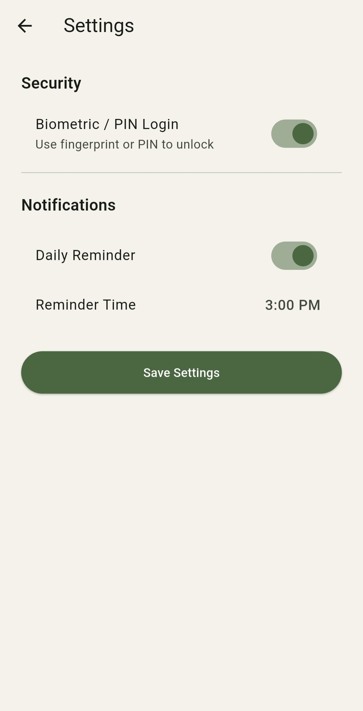
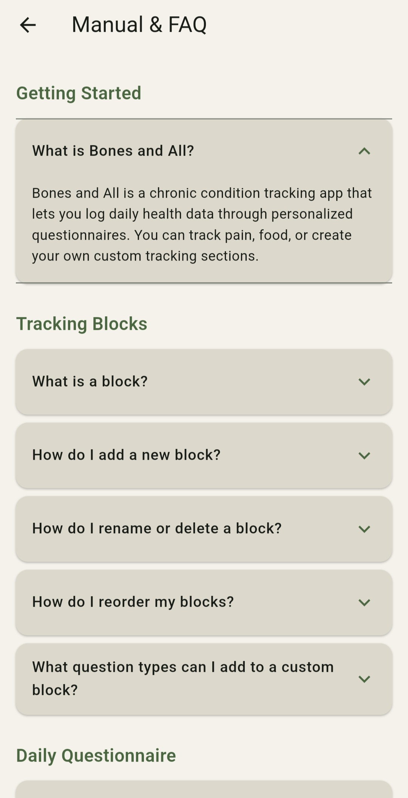

# Bones and All 

> A fully customizable chronic condition tracking Android application built as a Senior Honors Project at Western Illinois University.


---


---

## Overview

Bones and All is a full-stack Android mobile application designed to help users track and monitor chronic health conditions. The app centers around a highly customizable daily questionnaire system, allowing users to define exactly what they want to track — whether that is pain levels, mood, sleep, or any custom metric they choose.

The project was developed as part of a Senior Honors research study evaluating the effectiveness of AI models across different stages of the software development lifecycle, using Claude Sonnet as the primary AI development assistant.

**Backend repository:** [bones-and-all-backend](https://github.com/Kmorris1370/bones-and-all-backend)

---

## Features

| Feature | Description |
|---------|-------------|
| Secure Authentication | Email and password registration with JWT and bcrypt password hashing |
| Biometric Login | Fingerprint authentication with PIN fallback and 15-minute session timer |
| Interactive Body Map | Select and log pain locations on a visual body area selector |
| Pain Tracking | Log pain characteristics, type, and scale (0–10) |
| Custom Blocks | Build personalized tracking sections with text, scale, and tag questions |
| Daily Journaling | Add journal notes alongside questionnaire responses |
| Push Notifications | Optional daily reminders via Firebase Cloud Messaging with per-block controls |
| Data Visualization | Pain trend line chart and weekly frequency bar chart |
| Records & History | View, browse, and delete past questionnaire entries |
| Block Management | Reorder, rename, and delete tracking blocks |
| Profile & Settings | Manage display name, notification time, and biometric preferences |
| Manual & FAQ | Built-in accordion-style help screen |

---

## Tech Stack

| Layer | Technology |
|-------|-----------|
| Framework | Flutter (Dart) |
| State Management | Provider |
| Authentication | JWT + flutter_secure_storage |
| Biometric | local_auth |
| Push Notifications | Firebase Cloud Messaging |
| Local Storage | shared_preferences |

---

## Project Structure

```
lib/
├── main.dart                         # App entry point, AuthGate routing
├── theme.dart                        # AppColors — centralized color palette
├── config.dart                       # Environment config (prod/local)
├── api/
│   ├── api_client.dart               # Shared HTTP client with JWT injection
│   ├── auth_api.dart                 # Register and login
│   ├── blocks_api.dart               # Trackable blocks CRUD
│   ├── questions_api.dart            # Questions CRUD
│   ├── logs_api.dart                 # Daily log entries CRUD
│   ├── questionnaire_api.dart        # Questionnaire responses
│   ├── notifications_api.dart        # Notification preferences
│   └── profile_api.dart              # User profile management
├── models/
│   ├── block.dart                    # Block data model
│   └── question.dart                 # Question data model
├── providers/
│   └── auth_provider.dart            # Global auth state
├── services/
│   ├── biometric_service.dart        # Fingerprint auth + session timer
│   └── fcm_service.dart              # Firebase push notification init
├── utils/
│   └── logger.dart                   # Tagged debug logging
├── screens/
│   ├── landing_screen.dart           # Unauthenticated entry
│   ├── login_screen.dart             # Login form
│   ├── register_screen.dart          # Registration form
│   ├── onboarding_screen.dart        # First-run setup
│   ├── main_screen.dart              # Dashboard — lists all blocks
│   ├── block_detail_screen.dart      # Block options and notification toggle
│   ├── add_block_screen.dart         # Block and question creation
│   ├── questionnaire_screen.dart     # Daily questionnaire form
│   ├── summary_screen.dart           # Submission confirmation
│   ├── manage_questions_screen.dart  # Edit custom block
│   ├── records_screen.dart           # Historical log list
│   ├── log_detail_screen.dart        # Single log entry detail
│   ├── graphs_screen.dart            # Data visualization charts
│   ├── profile_screen.dart           # Profile management
│   ├── settings_screen.dart          # Notifications and biometric settings
│   ├── biometric_screen.dart         # Biometric auth gate
│   ├── notification_prompt_screen.dart # Notification permission request
│   └── manual_screen.dart            # Manual and FAQ
└── widgets/
    ├── auth_form.dart                # Reusable login/register form
    ├── body_map_widget.dart          # 12-area interactive body selector
    └── tags_selector_widget.dart     # Multi-select tag chips
```

---

## System Architecture


> The Flutter frontend communicates with the Node.js/Express REST API over encrypted HTTPS. Every request includes a
> JWT Bearer token verified by the backend. Firebase Cloud Messaging is triggered server-side via a scheduled cron
> job to deliver daily push notifications.

---

## Screenshots

### Onboarding & Authentication
 

### Tracking Blocks
  

### Daily Questionnaire
  

### Records & Data
  

### Notifications & Settings
 

### Manual & FAQ


---

## Getting Started

### Prerequisites
- [Flutter SDK](https://flutter.dev) (3.41+)
- Android Studio or VS Code
- A running instance of the [Bones and All backend](https://github.com/Kmorris1370/bones-and-all-backend)
- A Firebase project with FCM enabled and `google-services.json` configured

### Setup

Clone the repository:
```bash
git clone https://github.com/Kmorris1370/Bones-and-All.git
cd Bones-and-All
```

Install dependencies:
```bash
flutter pub get
```

Add your `google-services.json` from Firebase to `android/app/`.

Update the backend URL in `lib/config.dart`:
```dart
static const String productionUrl = 'https://your-railway-url.up.railway.app';
```

Run the app on a connected Android device:
```bash
flutter run
```

---

## Security

- All API communication encrypted via HTTPS/SSL
- JWT tokens stored securely using `flutter_secure_storage`
- Biometric authentication uses device-level security (fingerprint/PIN)
- Sensitive credentials excluded from version control via `.gitignore`

---

## Research Context

This project serves as the application component of a Senior Honors research paper:

> *"Through an in-depth analysis of Claude Sonnet as an AI assistant used throughout the development of the mobile application Bones and All, this study evaluates its effectiveness, limitations, and impact across different stages of the software development lifecycle to determine best practices for AI-assisted software development."*

**AI Model Used:** Claude Sonnet (Anthropic) — Primary development assistant throughout planning, design, backend development, frontend development, testing, and documentation.

**SDLC Stages Evaluated:**
- Project planning and architecture design
- Database schema design
- Backend REST API development
- Frontend Flutter development
- Testing and debugging
- Documentation

---

## Documentation
> Full developer documentation is available in the [project wiki](https://github.com/Kmorris1370/Bones-and-All/wiki)):
#### Frontend

1. [API Reference](https://github.com/Kmorris1370/Bones-and-All/wiki/API-Reference)

2. [JavaScript](https://github.com/Kmorris1370/Bones-and-All/wiki/JavaScript)

3. [Backend Structure](https://github.com/Kmorris1370/Bones-and-All/wiki/Backend-Structure)

4. [Middleware](https://github.com/Kmorris1370/Bones-and-All/wiki/Middleware)

5. [Firebase](https://github.com/Kmorris1370/Bones-and-All/wiki/Firebase)

6. [Database](https://github.com/Kmorris1370/Bones-and-All/wiki/Database)

7. [Security](https://github.com/Kmorris1370/Bones-and-All/wiki/Security)

8. [Railway](https://github.com/Kmorris1370/Bones-and-All/wiki/Railway)

9. [Project Build](https://github.com/Kmorris1370/Bones-and-All/wiki/Project-Build)

10. [System Architecture](https://github.com/Kmorris1370/Bones-and-All/wiki/System-Architecture)

11. [Maintenance](https://github.com/Kmorris1370/Bones-and-All/wiki/Maintenance)

12. [Known Issues](https://github.com/Kmorris1370/Bones-and-All/wiki/Known-Issues)

#### Backend 

1. [API Reference](https://github.com/Kmorris1370/Bones-and-All/wiki/API-Reference)

2. [JavaScript](https://github.com/Kmorris1370/Bones-and-All/wiki/JavaScript)

3. [Backend Structure](https://github.com/Kmorris1370/Bones-and-All/wiki/Backend-Structure)

4. [Middleware](https://github.com/Kmorris1370/Bones-and-All/wiki/Middleware)

5. [Firebase](https://github.com/Kmorris1370/Bones-and-All/wiki/Firebase)

6. [Database](https://github.com/Kmorris1370/Bones-and-All/wiki/Database)

7. [Security](https://github.com/Kmorris1370/Bones-and-All/wiki/Security)

8. [Railway](https://github.com/Kmorris1370/Bones-and-All/wiki/Railway)

9. [Project Build](https://github.com/Kmorris1370/Bones-and-All/wiki/Project-Build)

10. [System Architecture](https://github.com/Kmorris1370/Bones-and-All/wiki/System-Architecture)

11. [Maintenance](https://github.com/Kmorris1370/Bones-and-All/wiki/Maintenance)

12. [Known Issues](https://github.com/Kmorris1370/Bones-and-All/wiki/Known-Issues)

--- 

## Future Developments

- Timezone-aware push notifications
- Per-block notification times
- Password reset via email
- Persistent profile picture storage
- Built-in AI analysis of health patterns
- Mood, Sleep, and Food block templates
- Data export (CSV / PDF)
- Reward system for completing questionnaires

---

## Academic Context

| | |
|-|-|
| **Institution** | Western Illinois University |
| **Program** | Senior Honors Project |
| **Author** | Kaitlyn Morris |
| **Advisor** | Dr. Baramidze |
| **Semester** | Spring 2026 |

---

## License

MIT License — see [LICENSE](LICENSE) for details.
